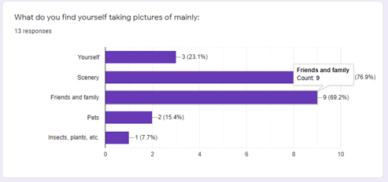
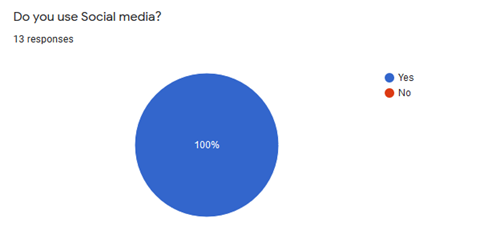
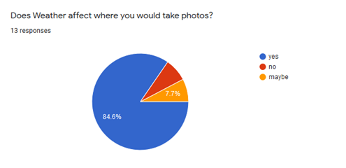
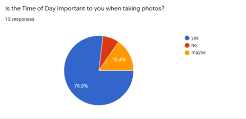
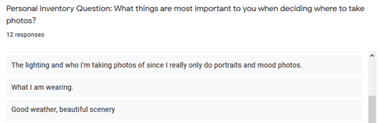

## STAGE TWO 

### Members (Team F/TUT03):  

Bryan Hyunh 

Don McEachern 

Ryan Liew 

Sajid Choudhry 

Sarina Zohdi 

 

### Portfolio Webpage:  

https://bryanhuynh.github.io/CPSC-481-Project/ 

### Portfolio GitHub: 

https://github.com/BryanHuynh/CPSC-481-Project 

# PhotoCator 

### Description: 

 

Our project idea is a photography landmark locator. This application is going to look like a navigation app like google maps, but instead the focus of this app is for people to share unique and interesting locations for beautiful photography. To do this, when a photo is uploaded, they will be asked to give a description of the longitude and latitude of the photo, along with the date and time of day, so that one can go out and recreate the photo if the wish. We also plan to link it towards social media, so you can see the pictures that your peers take.  

 

#### How do you expect the system to be used? 

We expect the user to use this whether they are an aspiring new photographer or a professional to find different interesting and exciting places to take photos. By sharing their pictures of the places that they have found themselves we expect them to help broaden and bring together the photography community.

#### By whom will the system be used? 

We expect that the users that will use our system, will be anybody who wants to take pictures. There is no limit for anyone to use this application. 

### Stakeholders: 

- Advertisers 

- Freelancers/Models - can be used as a portfolio builder 

- Architects/Artists - they care about how their work will be represented 

- Park conservationists – data can be gathered on which parks are being visited most. 

### Users: 

- Target Audience is anyone who wants to take pictures 

## IDEO Cards 

### Surveys and Questionnaires 

- Justification: Creating a survey is incredibly helpful for gathering user research because we can directly ask our users information that can help us develop our application. 

- What went well: Our survey gave us critical information that we will take into consideration when developing or application. For example, all our applicants said they use social media, this means that linking our application to social media is a critical function. 

- What went poorly: We failed to ask questions to narrow the different patterns in the age demographic that we defined in our character profiles.   

- What we could have done differently: Give more examples on our survey questions, to help clearly any uncertainties with the questions. We also should have created more directed questions to narrow the different patterns in the age demographic for our character profile. We should not have included the “maybe” option because this makes it way more difficult to analyze our data that we collected when people answer “maybe”. 

- Summary of our findings: We found that a hundred percent of applicants use social media, this means that implementing a social media linkage would be crucial for our app. A lot of our applicants also mainly like taking pictures at around national parks, this means that majority of our applicants like taking pictures outside in nature. We also have discovered that more than 80 percent of our applicants take different photos based on weather, this means that implementing a function that displays different photos taken during different weather conditions would be a valuable function

### Personal Inventory 

- Justification: By asking different users what they think are important items to them when taking photos helps us identify what personal values and items the user believes to be important when they are going to be engaging with the application.  

- What went well: We received lots of different answers with the questions attached to our surveys. 

- What went poorly: Since we didn’t give examples in asking these questions, we did get a lot of overlap in some answers 

- What we could have done differently: Asked the personal inventory questions to be more pointed to narrow down answers that are more unique to each participant. 

- Summary: We found from the answers that with the trend of the participants phone being one of the first things listed as important to them when taking photos, we found that all users should have their phones around so it would maybe make more sense to change the medium of the application to mobile over web. 

