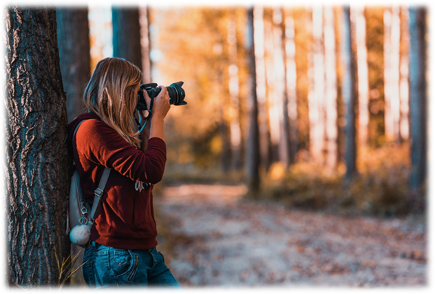

<a href="https://bryanhuynh.github.io/CPSC-481-Project">Phase one</a>

<a href="https://bryanhuynh.github.io/CPSC-481-Project/Site/stage2">Phase two </a>
  
[Phase three]()

[Phase four]()

[Phase five]()

## STAGE TWO 

### Members (Team F/TUT03):  

Bryan Hyunh 

Don McEachern 

Ryan Liew 

Sajid Choudhry 

Sarina Zohdi 

 

### Portfolio Webpage:  

https://bryanhuynh.github.io/CPSC-481-Project/ 

### Portfolio GitHub: 

https://github.com/BryanHuynh/CPSC-481-Project 

# PhotoCator 

### Description: 

 

Our project idea is a photography landmark locator. This application is going to look like a navigation app like google maps, but instead the focus of this app is for people to share unique and interesting locations for beautiful photography. To do this, when a photo is uploaded, they will be asked to give a description of the longitude and latitude of the photo, along with the date and time of day, so that one can go out and recreate the photo if the wish. We also plan to link it towards social media, so you can see the pictures that your peers take.  

 

#### How do you expect the system to be used? 

We expect the user to use this whether they are an aspiring new photographer or a professional to find different interesting and exciting places to take photos. By sharing their pictures of the places that they have found themselves we expect them to help broaden and bring together the photography community.

#### By whom will the system be used? 

We expect that the users that will use our system, will be anybody who wants to take pictures. There is no limit for anyone to use this application. 

### Stakeholders: 

- Advertisers 

- Freelancers/Models - can be used as a portfolio builder 

- Architects/Artists - they care about how their work will be represented 

- Park conservationists – data can be gathered on which parks are being visited most. 

### Users: 

- Target Audience is anyone who wants to take pictures 

## IDEO Cards 

### Surveys and Questionnaires 

- Justification: Creating a survey is incredibly helpful for gathering user research because we can directly ask our users information that can help us develop our application. 

- What went well: Our survey gave us critical information that we will take into consideration when developing or application. For example, all our applicants said they use social media, this means that linking our application to social media is a critical function. 

- What went poorly: We failed to ask questions to narrow the different patterns in the age demographic that we defined in our character profiles.   

- What we could have done differently: Give more examples on our survey questions, to help clearly any uncertainties with the questions. We also should have created more directed questions to narrow the different patterns in the age demographic for our character profile. We should not have included the “maybe” option because this makes it way more difficult to analyze our data that we collected when people answer “maybe”. 

- Summary of our findings: We found that a hundred percent of applicants use social media, this means that implementing a social media linkage would be crucial for our app. A lot of our applicants also mainly like taking pictures at around national parks, this means that majority of our applicants like taking pictures outside in nature. We also have discovered that more than 80 percent of our applicants take different photos based on weather, this means that implementing a function that displays different photos taken during different weather conditions would be a valuable function

### Personal Inventory 

- Justification: By asking different users what they think are important items to them when taking photos helps us identify what personal values and items the user believes to be important when they are going to be engaging with the application.  

- What went well: We received lots of different answers with the questions attached to our surveys. 

- What went poorly: Since we didn’t give examples in asking these questions, we did get a lot of overlap in some answers 

- What we could have done differently: Asked the personal inventory questions to be more pointed to narrow down answers that are more unique to each participant. 

- Summary: We found from the answers that with the trend of the participants phone being one of the first things listed as important to them when taking photos, we found that all users should have their phones around so it would maybe make more sense to change the medium of the application to mobile over web. 

### Character Profiles 

- Justification: Creating separate demographics of different people within different age groups can help us identify relations between the different groups and our application functions. 

- What went well: By creating these character profiles, it helps us identify the different kinds of users that will interact with our product. Therefore, it makes it easier for us to create an app that can be used by all demographics 

- What went poorly: Since our survey failed to narrow the different patterns in the age demographic that we defined in our character profile. It was hard to find relations between the demographics and our survey questions. 

- What we could have done differently: We could have analyzed our survey data more critically to help us identify patterns to help us develop a more detailed character profile. 

- Summary of our findings: Based off survey and its relation to the character profiles, we learned that all applicants within all demographics use social media.  

*To see images of character profiles check Appendix* 

## User-Task Descriptions 
 

### Must Be Included: 

#### Log-in to account: 

- User opens webpage on computer or phone, clicks the login button in the corner of the screen.  

- The user is taken to a new screen and enters their username and password, clicks login button to verify login. 

 

#### View photo-feed: 

- Once logged in they can see different landmarks near them on the map. They click on one of the pins marking a location for photo taking. 

- A scroll page of photos taken at that location appears and they can scroll through it using the sidebar on the page or swiping if on phone or tablet. 

- A map of the globe: 

- There will be a globe that contains many pins on a google map of all the photos taken.  

- Signing up for an account: 

- The user will require an account to post and like photos. To do this the user will require to sign up with their google account that can be linked with the app itself 

 

#### Filtering photos based on tags, time, and likes: 

- Because the globe can be very clustered with the number of photos taken, the user has the option to configure which pins they will see on the globe. For example, the user can filter to only see photos that are tagged as landscapes, or portraits. In addition, they can filter based on when the photo was taken by say within a day, a week, a month, or years.  

- Finally, they can filter based on the number of likes. Say the user only wants to see pins with >N likes. Or they want to see the hottest photos which will be a ratio of likes and date posted.  

#### Viewing more information of an image: 

- When they scroll through the feed of photos for a given pin, they can click on a specific photo to see more information about it.  

- This activity will show when the photo was taken, the number of likes it has, its specific location along with its whether.  

 

### Important: 

 

#### View friends’ profiles: 

- Once the user is logged in to the app, they can view what pictures they took, where they took their pictures, their reviews on certain places for pictures. You can also view their social media page displaying some of the pictures that they took from that location. 

 

#### Upload a photo to the website: 

- On the home screen when the user is logged in, they click the ‘add photos’ button, then they are given the option to select the photo’s they want to upload. Once they made their selections, they will be asked to add a location on the map where they took their photos. Once they select the location, they click the finish button and the photos are uploaded and tagged to the location the user selected. 

 

### Could be included: 
#### Commenting/Reviewing photographs: 

- The user can also add comments to these photos if they have signed into an account. 

#### Providing social media information of the photographer or model, to see more of their work: 
- Social media links of the photographer and of any model that was in the photo. 

## *Appendix: *

 
- Character Profile Format taken from here: https://studylib.net/doc/8597949/creating-character-profiles-following-the-ideo 

### Profiles

| Group | Age:15-19|
|---|---|
| Name | Jennifer |
| Age | 16 |
| Gender | Female |
| Work | Jobless |
| Free Time | 6 - 9 hours on weekdays, all day on weekends. |
| Hobbies | Social Media(TikTok, Instagram, SnapChat), Volleyball, Modeling, Horseback Riding. |
| Goal for using product | Posting beautiful pictures on social media. To show off to friends and family. |
| Camera | iPhone Camera |

| Group | Age:20-25|
|---|---|
| Name | Stephen |
| Age | 22 |
| Gender | Male |
| Work | Part-time cashier at a grocery store  |
| Free Time | Couple hours each night (depending on school workload and work schedule) |
| Hobbies | Working out, video games, ultimate frisbee.  |
| Goal for using product | Taking pictures at good viewpoints to show off to his friends and family. As well as searching for professional places to take photos for his dream career in the future  |
| Camera | iPhone Camera |

| Group | Age:26-30|
|---|---|
| Name | Joe |
| Age | 27 |
| Gender | Male |
| Work | Mechanical Engineer |
| Free Time | 2 hours at night during the week and 5-6 hours during the weekend  |
| Hobbies | Going to the gym and finding new places to dine in.  |
| Goal for using product | He wishes to take cool photos to show to wife and co-workers. Also, to hopefully find cool places to take his kids to and have a family day.  |
| Camera | DSLR |

| Group | Age:31+ |
|---|---|
| Name | Bertha |
| Age | 65 |
| Gender | Female |
| Work | Retired |
| Free Time | Free most of the day |
| Hobbies | Visiting grandkids and going on walks   |
| Goal for using product | To create as many memories with her family members. |
| Camera | SLR Film Camera |

#### Personal Inventory Questions:

#### Survey Questions (not all):

Title image source:  https://www.pexels.com/photo/adult-blur-camera-dirt-road-610293/  
