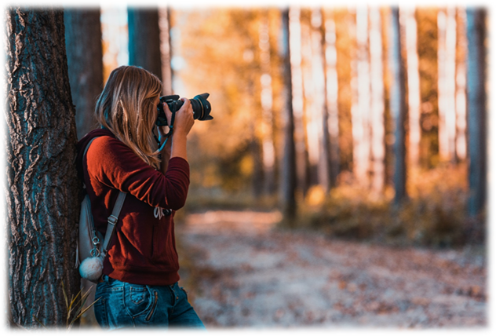

## PhotoCater 
<a href="https://bryanhuynh.github.io/CPSC-481-Project">- Phase one</a>    <a href="https://bryanhuynh.github.io/CPSC-481-Project/Site/stage2">- Phase two </a>    <a href="https://bryanhuynh.github.io/CPSC-481-Project/Site/stage4">- Phase Four</a>    <a href="https://bryanhuynh.github.io/CPSC-481-Project/Site/stage5">- Phase Five</a>

## Stage 3

#### Members (Team F/TUT03):  

Bryan Hyunh 

Don McEachern 

Ryan Liew 

Sajid Choudhry 

Sarina Zohdi 

  

#### Portfolio Webpage:  

https://bryanhuynh.github.io/CPSC-481-Project/ 

#### Portfolio GitHub: 

https://github.com/BryanHuynh/CPSC-481-Project 

## PhotoCater

### Project Description: 

Our project idea is a photography landmark locator. This application is going to look like a navigation app like google maps, but instead the focus of this app is for people to share unique and interesting locations for beautiful photography. To do this, when a photo is uploaded, they will be asked to give a description of the longitude and latitude of the photo, along with the date and time of day, so that one can go out and recreate the photo if the wish. We also plan to link it towards social media, so you can see the pictures that your peers take. 

### Affinity Diagram 

| Quality of Life/ Usability | Finding Landmarks | Sharing Pictures |
|---|---|---|
| acessibility option | Scrollable Map area | For location area using pin and radar|
| Changing temp Format | Exploring popular images of a landmark | Manual location entry |
| Saving favourites | Filtering | Comments and Reviews |
| Increasing site text size | All pins appear in photo feed | Messaging client |
| Customizable profiles | a preview image with description when you click on an image | Reviewing and commenting on photos |
| Credential based log in using varioius platforms (ex, Twitter, Facebook) | Search bar for finding pictures | Profile page |
| Changing your user profile | Providing Date and weather data for pictures | Viewing Contact list |
| Add Notifications to the user | Busy Alert for covid-19 and other emergencies | Choosing a pin or radar to display location of the picture |
| Toggling for comic sans (accessibility) | Slider picture menu | Social media linkage |
| Changing language | Slider picture Menu | Being able to click on the map when you upload an image to add a new location |
| Having Dark Mode | A preview image with description when you click on an image | Reviewing Pictures and adding the location with pins and radars |
| Changing user profile | | Having in site friends and social media connections | 
| | | Uploading pictures |

### Top 3 Ideas

1. SOCIAL MEDIA LINKAGE 

- We want to use this app to increase exposure to all photographers despite their follow count.  

- By linking their social media, it will allow for people who find photos that they post to follow up and find even more photos on their social page.  

- When signing up, the users have a choice of linking their social media to their account, their choices for social media will be: 

    - Instagram 

    - Facebook 

    - Twitter 

- If they did not link their account when signing up, they will still have a choice in linking their account through the friend's tab on the main screen. 

- The user also has a choice of logging into their account with their choice of social media platform. 

2. FINDING NEW PHOTOS 

- We hope for people to find new photos and photographers of all follower counts.  

- The user can do many actions to find a photo of their choosing 

    - On the main screen there will be pins on the map, indicating pictures that we're taken from that place, when those pins are clicked a photo feed of pictures that were taken there will appear 

    - They can also filter these pins by categories 

        - Architectural 

        - Model 

        - Scenery 

        - Landscape 

        - Etc 

    - Choosing a filter will result in showing different pins based on the chose category. 

    - The search bar is used for searching specific places or coordinates to view pictures taken in that area. 

- The pin also contains much information of the pictures taken in that area: 

    - Reviews on the area 

    - If it's busy or not (COVID) 

    - When it was taken 

    - Etc 

- Also, the user will have a choice of seeing directions to get to that area, when the pin is clicked 

3. UPLOADING PICTURES 

- When the user has taken the photos that they want, and they upload them once they have copied them onto their computer or have them on their phone, they will have the option to upload the photos along with the location they were taken. When they click the upload button they will be taken to another screen where they will have to pick a pin or add a new one for where they took the photos. 

- If they are adding a new pin, they will be asked which form they would like to enter the location that could be one of the following choices: 

    - Google maps api search 

    - Lat long entry 

    - Pin drop on map  

- Once they enter the location of photoshoot, they can add comments or descriptions to like: 

    - Type of camera used  

    - How busy the location is  

    - Weather 

 ### Discussion of Groups

- Quality of Life/ Usability 

    - This grouping tangentially relates to the design requirement of logging in to the application, as well as interacting with uploaded assets. A weakness of this group is that it does not encompass any concise functionality. On the other hand, the generality it provides can be considered a strength as it allows for implementations that are universal to the web app. For example. By considering the accessibility idea, all UI components become more user-friendly to a more diverse range of people. The idea is feasible as it is simply taking existing functionality and making it easier to use. The grouping is also original, since ideas such as accessibility in a social media app, are rarely intricately implemented. 

- Finding Landmarks 

    - This grouping relates to the design requirements developed from the user-task descriptions of stage 2. Specifically, the tasks of viewing a map of the globe to be able to view landmarks on it, filtering available landmarks based on the user's preferences, and viewing more information about landmarks that the user is focusing on. A weakness of this grouping is that it does not take into consideration the social integration aspect of the web app, which is a major component of the app. A strength of this grouping is that it gives a good idea of how users will primarily interact with the app, which is through the use of a traversable map, in order to focus in on what the user is looking for. Furthermore, the grouping introduces the idea of filtering based on a user's needs, which is also a main functionality that succinctly provides users with the information they desire. As for feasibility, as finding landmarks is one of the most significant features of the web app, time can certainly be provided in developing this grouping. The idea of traversing a map to find locations isn’t original, however making it a main feature of a social media application certainly is. 

- Sharing Pictures 

    - This ties into the design requirements developed from the user-tasks of stage 2. Logging-in to an account creates the idea of a user within the web app ecosystem. By tying a user to an account, a user ends up with an identity on the web application. Viewing a photo feed is another user task related to this group, as is viewing a friends profile of pictures and uploading a users own assets to the website. A strength of this grouping is that it describes the social integration aspect of the web application. It considers the interactions that users will have with the system (web app) as well as the interactions that users will have with each other, in the form of uploading, sharing, and commenting on pictures that have been taken. A weakness of this grouping is that it does not consider the User Interface of the application. Ideas such as uploading pictures, credential-based log-in, and viewing profiles of friends, are all feasible ideas, and also major parts of the web app. A less feasible idea (time-permitting) would be the commenting on pictures idea. This grouping of sharing pictures is original when it is considered in relation to what is being shared, which in this case are pictures taken with extensive meta-data that includes items such as weather data, time of day, and latitude and longitude location data, among other things. 

### Tasks prototyped: 

- Vertically: 

    - Uploading and sharing photos 

    - Social Media Linkage 

    - Finding Photos and landmarks 

- Horizontally: 

    - Logging in to the website with a photocator account 

    - Searching for locations 

    - Viewing and adding friends (All social media platforms) 

    - Leaving a review on a location or commenting on a photo 

    - Read reviews or comments on a location 

    - Users can edit and customize their own profile 

    - An accessibility tab is there to accommodate Users with unique needs 

    - Add a new location 

    - Users can go to other user’s or friend’s social media to see more photos by that user 

### Vertical Diagrams

#### Uploading and Sharing Photos

| Description of Task | Does the User have training or knowledger to do this step? | Is it believable that they woiuld do it? | Are they Motivated? | Comments (including possible solutions) | 
|---|---|---|---|---|
| User presses the '+' sign at the top left forner of the interface | No | yes| Yes, they want to upload a picture. | When the user mouses over the idon it says "Upload photo" |
| User picks a photo to be uploaded| no | yes | yes, they have a photo that they want to upload | have a button that says "select photo" below the iumage thumbnail |
| User puts a pin on the map | no | yes | location is requyired for the photo to be uploaded | Have a message on the top of the window telling the user to click anywhere to apply a pin |
| User selects tags about the photo type | yes | yes | Yes, it is required to have at least one tag to be uploaded | There is a list of predefined tags that the user can pick from |
| User defines Camera | yes | yes | Fields required by the user like the type of camera used to take the photo must be filled out | This can be filled out automatically with the meta data if it exists |
| Upload photo | yes | yes | Yes, it is required to successfully share a photo | There is a button that says "Upload" |

#### Social Media Linkage
| Description of Task | Does the User have training or knowledger to do this step? | Is it believable that they woiuld do it? | Are they Motivated? | Comments (including possible solutions) | 
|---|---|---|---|---|
| Click on Friends tab | yes | yes | Yes, if they want to see their friends and link social media they will go look for where those connections are | Yes, if they want to see their friends and link social media they will go look for where those connections are |
| Click on Link social media button | Yes | Yes | Yes, to link their social media they will need to provide the information to link the account | This can be changed/removed or added later in their profile settings page |
| Click on the social media icon they want to link | yes | yes | Yes, they have in mind the social media account they want to link so they will go looking for it| This will open a new tab in the browser, that follows to the user's social media page |
| Fill in their information for that social media they selected | yes | yes | Yes, Photocator needs that information to make the connection, so if they want to attach a social media account to it, they will need to provide this information. | They will only need to do this once and will not be required to do this for ever post they make |
| Click login button | yes | yes | Yes, they will want to complete the process | The login button will be at the bottom of the form so that their eye naturally follows to the next step |

#### Finding Photos or Landmarks
| Description of Task | Does the User have training or knowledger to do this step? | Is it believable that they woiuld do it? | Are they Motivated? | Comments (including possible solutions) | 
|---|---|---|---|---|
| Login or sign up | yes | yes | yes | They can save their sign in so they only need to do it once per computer |
| Adding filters | yes | yes | yes | There will be a list of tags that they the user can select |
| Click on a pin on the map to preview a photo | no | yes | Yes, that is one of the ways to view other photos from that location | When the click on a pin, they can easily close the preview menu so that they can find another pin. They can zoom into a map so that they can more accurately select a certain pin |
| They click on the feed to preview a photo | no | yes | If they find a photo that they are interested in and want to know more about it | The menu is on the home page for ease of access, and allowing them to quickly find a large set of photos quickly |

#### Accessibility Tab Usage 

| Description of task step | Does user have training or knowledge to do this step? | Is it believable that they would do it? | Are they motivated? | Comments (including possible solutions) |
|---|---|---|---|---|
| User clicks on the accessibility icon in the top right corner | No | Yes | Yes, if the user has certain issues with interacting with a webpage for example has dyslexia, they will be looking for tools to make their experience easier  | The icon could use a label to help more clearly define what its there for |
| The user selects the options that they would like enabled | Yes | Yes | Yes | They would know which options to turn on since they would be very familiar with their challenges. |
| User clicks Enable button | Yes | Yes | Yes, as this will enact rules they have selected to affect the site. ||

#### Editing and customizing the user's own profile

|Description of task step |Does user have training or knowledge to do this step? |Is it believable that they would do it? |Are they motivated? |Comments (including possible solutions) |
|---|---|---|---|---|
|The user clicks on the ‘profile’ icon in the top right corner. |No |Yes |Yes |The icon is quite like the friend's icon, we can fix this by giving the icon a small label |
|The user clicks the ‘edit’ button on her own profile page |Yes |Yes |Yes |The button is placed right in the middle of the header, it is very hard to miss |
|The user clicks on the empty text field and adds a biography about themselves. |Yes |Yes |Depends if they want people to know what kind of person, they are |This part is optional the user can either choose to write a biography about themselves or not. |
|The user clicks on the social media icons and links their social media. |Yes |Yes |Depends if the user wants to share their social media with others |This part is also optional, the user can choose whether to leave them unlinked or linked |
|The user clicks on “add pictures” button to upload a new photo to his profile. |Yes |Yes |Yes ||

 

 

